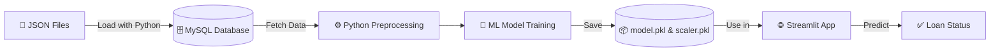

Absolutely! Here's the **final, polished `README.md`** file with your original content, improved formatting, and a new **screenshot section** added at the end for visual appeal. This will help users instantly understand how the app looks and functions.

---

```markdown
# 🏦 Loan Prediction App

This project is an **end-to-end Data Engineering & Machine Learning pipeline** that predicts **Loan Approval Status**.  
The workflow involves **loading JSON data into MySQL**, training a classification model in Python, saving the model as a `.pickle` file, and finally deploying it as a **Streamlit web app**.

---

## 📌 Project Workflow

1. **Data Preparation**
   - Split the dataset into **three JSON files**:  
     - `applicant_info.json` → Applicant details  
     - `financial_info.json` → Financial details  
     - `loan_info.json` → Loan details  

2. **Database Storage**
   - Loaded JSON files into **MySQL database (`loan_db`)** using Python.

3. **Machine Learning**
   - Fetched data from MySQL into Python.
   - Performed preprocessing (encoding, scaling).
   - Trained a **RandomForestClassifier** model.
   - Saved the trained model and scaler as `.pkl` files.

4. **Streamlit Deployment**
   - Built a user-friendly **Streamlit app** (`app.py`) that:
     - Takes input from users.
     - Applies the same preprocessing.
     - Loads the saved model.
     - Predicts **Loan Approval Status** (Approved / Rejected).

---

## 🔄 Workflow Diagram



---

## 🚀 Live Demo

🔗 [View Live App on Streamlit](https://miniprojectdataengineering-loan-pratik.streamlit.app/)


---

## 📂 Project Structure

```
├── app.py                  # Streamlit web application
├── train_model.py          # ML training script (from MySQL to .pickle)
├── load_data_mysql.py      # Script to load JSON data into MySQL
├── applicant_info.json     # Applicant dataset
├── financial_info.json     # Financial dataset
├── loan_info.json          # Loan dataset
├── model.pkl               # Trained ML model (pickle)
├── scaler.pkl              # Preprocessing scaler (pickle)
├── app_screenshot.png      # Screenshot of the Streamlit app
├── requirements.txt        # Project dependencies
└── README.md               # Project documentation
```

---

## ⚙️ Installation & Setup

```bash
# Clone the repository
git clone https://github.com/your-username/loan-prediction-app.git
cd loan-prediction-app

# Create virtual environment
python -m venv venv
source venv/bin/activate   # On Linux/Mac
venv\Scripts\activate      # On Windows

# Install required packages
pip install -r requirements.txt

# Run the Streamlit app
streamlit run app.py
```

> 🔒 **Note**: Make sure MySQL is running and update database credentials in `load_data_mysql.py` and `train_model.py` if needed.

---

## 🛠️ Tech Stack

- **Python 3.12+**
- **Pandas, NumPy** – Data manipulation
- **Scikit-learn** – Machine Learning (RandomForestClassifier)
- **PyMySQL / SQL Alchemy** – MySQL integration
- **Streamlit** – Web app frontend
- **Pickle** – Model serialization
- **Mermaid.js** – Diagram rendering (in README)

---

## 📄 Requirements

Ensure you have:
- Python 3.12 or higher
- MySQL server installed and running
- Internet connection (for package installation)

---

👨‍💻 Developed with ❤️ by [Pratik Ramteke](https://github.com/PratikPhysics)
```

---

